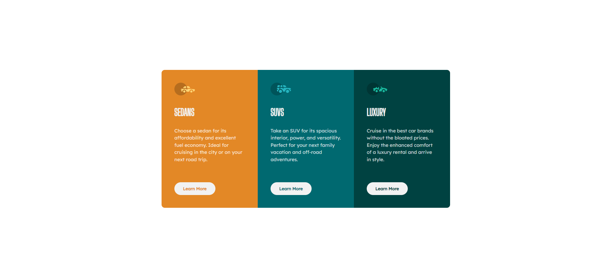

# Frontend Mentor - 3-column preview card component solution

This is a solution to the [3-column preview card component challenge on Frontend Mentor](https://www.frontendmentor.io/challenges/3column-preview-card-component-pH92eAR2-).

## Table of contents

- [Overview](#overview)
  - [The challenge](#the-challenge)
  - [Screenshot](#screenshot)
  - [Links](#links)
- [My process](#my-process)
  - [Built with](#built-with)
  - [Useful resources](#useful-resources)
- [Author](#author)

## Overview

### The challenge

Users should be able to:

- View the optimal layout depending on their device's screen size
- See hover states for interactive elements

### Screenshot

### Links

- Solution URL: [https://github.com/MitiaElodie/3-column-preview-card-component-main](https://github.com/MitiaElodie/3-column-preview-card-component-main)
- Live Site URL: [https://3-column-preview-card-component-main-lime.vercel.app/](https://3-column-preview-card-component-main-lime.vercel.app/)

## My process

### Built with

- Semantic HTML5 markup
- CSS custom properties
- Flexbox
- SCSS
I have spent 4 pomodoros on it. (25mn per pomodoro)
### Useful resources

- [CSS-Tricks](https://css-tricks.com/almanac/properties/l/line-height/) - This helped me understand the line-height property.

## Author

- Frontend Mentor - [@MitiaElodie](https://www.frontendmentor.io/profile/MitiaElodie)